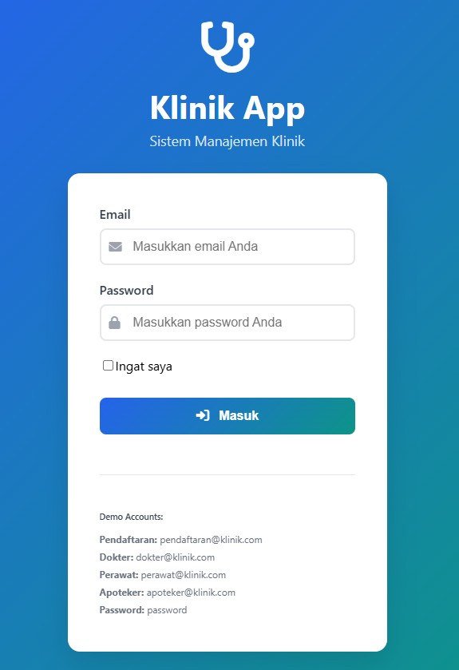

# 🏥 SISTEM MANAJEMEN KLINIK

Sistem Informasi Klinik berbasis Laravel dengan Role-based Medical Workflow

[](https://laravel.com/)
[](https://php.net/)
[](https://mysql.com/)
[](LICENSE)

## 📋 DESKRIPSI

Sistem Manajemen Klinik adalah aplikasi web berbasis Laravel yang dirancang untuk mengelola workflow medis di klinik dengan sistem role-based authentication. Sistem ini memfasilitasi alur kerja lengkap dari pendaftaran pasien hingga pemberian resep obat.

### Fitur Utama:
- 🎭 **4 Role System**: Pendaftaran, Perawat, Dokter, Apoteker
- 🔄 **Complete Medical Workflow**: Registration → Vital Signs → Diagnosis → Prescription → Completed
- 💊 **Medicine Management**: Stock control dengan validasi real-time
- 📊 **Professional Dashboard**: Statistik dan quick actions untuk setiap role
- 📋 **Medical Records**: Rekam medis lengkap dengan timeline progress
- 🎨 **Modern UI/UX**: AdminLTE dengan medical theme

## 📸 SCREENSHOTS

### 🔐 Login
<div align="left" style="margin-bottom: 20px;">
  
</div>

### 📝 Pendaftaran (Admin)
<div align="left" style="margin-bottom: 20px;">
  
  
  
  
</div>

### 👩‍⚕️ Perawat
<div align="left" style="margin-bottom: 20px;">
  
  
  
</div>

### 👨‍⚕️ Dokter
<div align="left" style="margin-bottom: 20px;">
  
  
  
  
</div>

### 💊 Apoteker
<div align="left" style="margin-bottom: 20px;">
  
  
  
  
  
</div>

---

### 🎯 Complete Medical Workflow Preview
<div align="center" style="margin-top: 30px;">
  
  
  
  
  
</div>

## 🚀 QUICK START

### Prerequisites
- PHP 8.0+
- Composer
- MySQL 5.7+
- Web Server (Apache/Nginx)

### Installation

1. **Clone Repository**
   ```bash
   git clone https://github.com/lutfisugandi/sistem-klinik-laravel.git
   cd sistem-klinik-laravel
   ```

2. **Install Dependencies**
   ```bash
   composer install
   ```

3. **Environment Setup**
   ```bash
   cp .env.example .env
   php artisan key:generate
   ```

4. **Database Configuration**
   
   Edit file `.env`:
   ```env
   DB_CONNECTION=mysql
   DB_HOST=127.0.0.1
   DB_PORT=3306
   DB_DATABASE=klinik_app
   DB_USERNAME=root
   DB_PASSWORD=
   ```

5. **Database Setup**
   
   **Opsi A: Menggunakan Migration & Seeding (Recommended)**
   ```bash
   php artisan migrate:fresh --seed
   ```
   
   **Opsi B: Import Database SQL Dump**
   ```bash
   # Buat database terlebih dahulu
   mysql -u root -p -e "CREATE DATABASE klinik_app;"
   
   # Import file SQL
   mysql -u root -p klinik_app < database/sql/klinik_db.sql
   ```

6. **Start Server**
   ```bash
   php artisan serve
   ```

7. **Access Application**
   ```
   http://localhost:8000
   ```

## 🗄️ DATABASE INFORMATION

### Database Structure

Sistem ini menggunakan database MySQL dengan struktur yang telah dioptimasi untuk workflow medis:

#### Core Tables:
- **users** - User authentication dengan role system
- **patients** - Data pasien dengan auto-generate nomor
- **medical_records** - Rekam medis dengan workflow status
- **medicines** - Master data obat dengan stock management
- **prescriptions** - Detail resep obat per kunjungan

#### Workflow Status:
```
registered → vitals_checked → diagnosed → prescribed → completed
```

### Database Files:
- **Migrations**: `database/migrations/` - Schema database dalam format Laravel migration
- **Seeders**: `database/seeders/` - Sample data untuk testing
- **SQL Dump**: `database/sql/klinik_db.sql` - Complete database dump dengan structure dan data

### Sample Data Include:
- ✅ 4 Staff medis dengan role berbeda
- ✅ 8 Pasien sample dengan history
- ✅ 12 Obat umum Indonesia (Paracetamol, Amoxicillin, dll)
- ✅ 5 Medical records dengan berbagai status workflow

### Database Restore:
Jika menggunakan SQL dump, file `database/sql/klinik_db.sql` berisi:
- Complete table structure
- Sample data untuk testing
- Indexes dan constraints
- Default users dengan password

## 👥 LOGIN CREDENTIALS

| Role | Email | Password | Akses |
|------|-------|----------|-------|
| Admin Pendaftaran | pendaftaran@klinik.com | password | Daftar pasien, buat kunjungan |
| Perawat | perawat@klinik.com | password | Input vital signs |
| Dokter | dokter@klinik.com | password | Input diagnosis |
| Apoteker | apoteker@klinik.com | password | Kelola obat & resep |

## 🔄 MEDICAL WORKFLOW

### 1. Pendaftaran Pasien
- Admin mendaftarkan pasien baru
- Buat kunjungan baru untuk pasien existing
- Auto-generate nomor pasien & kunjungan

### 2. Vital Signs (Perawat)
- Input berat badan, tekanan darah, suhu, nadi
- Auto-calculate BMI
- Real-time warning untuk nilai abnormal
- Validasi input dengan panduan medis

### 3. Diagnosis (Dokter)
- Input keluhan dan diagnosis pasien
- Quick templates untuk diagnosis umum
- Deteksi kondisi urgent dari vital signs
- Catatan dan rencana tindak lanjut

### 4. Prescription (Apoteker)
- Buat resep obat berdasarkan diagnosis
- Dynamic medicine selection dengan stock validation
- Auto-calculate total biaya
- Stock management otomatis

## 🎯 TESTING GUIDE

### Complete Workflow Test:
1. Login sebagai **Pendaftaran** → Daftar pasien baru
2. Login sebagai **Perawat** → Input vital signs
3. Login sebagai **Dokter** → Input diagnosis
4. Login sebagai **Apoteker** → Buat resep obat

### Key Features to Test:
- ✅ Real-time validation (vital signs abnormal, stock check)
- ✅ Auto-calculations (BMI, total harga obat)
- ✅ Dynamic forms (add/remove medicine rows)
- ✅ Quick templates (diagnosis & prescription presets)
- ✅ Role-based access (menu visibility per role)

## 🛠️ TECHNICAL SPECIFICATIONS

### Backend:
- **Framework**: Laravel 9.x
- **Language**: PHP 8.0+
- **Database**: MySQL with Eloquent ORM
- **Authentication**: Laravel built-in auth
- **Validation**: Server-side validation

### Frontend:
- **Template**: AdminLTE 3.2
- **CSS Framework**: Bootstrap 4
- **Icons**: Font Awesome 6
- **JavaScript**: jQuery + Custom scripts
- **Theme**: Custom medical theme

### Key Laravel Features Used:
- Eloquent Relationships
- Migration & Seeding
- Request Validation
- Route Model Binding
- Middleware Authentication
- Blade Templating

## 📁 PROJECT STRUCTURE

```
app/
├── Http/Controllers/
│   ├── DashboardController.php
│   ├── MedicalRecordController.php
│   ├── MedicineController.php
│   ├── PatientController.php
│   └── Auth/
├── Models/
│   ├── User.php
│   ├── Patient.php
│   ├── MedicalRecord.php
│   ├── Medicine.php
│   └── Prescription.php

resources/views/
├── layouts/app.blade.php
├── auth/login.blade.php
├── dashboard/
├── medical-records/
│   ├── vitals/
│   ├── diagnosis/
│   └── prescriptions/
├── medicines/
└── patients/

database/
├── migrations/
├── seeders/DatabaseSeeder.php
└── sql/
    └── klinik_db.sql
```

## 🔧 CONFIGURATION

### Environment Variables:
```env
APP_NAME="Sistem Klinik"
APP_URL=http://localhost
DB_DATABASE=klinik_app
```

### Key Configurations:
- **Timezone**: Asia/Jakarta (configurable)
- **Language**: Indonesian interface
- **Session**: File-based sessions
- **Pagination**: 15 items per page

## 🚨 TROUBLESHOOTING

### Common Issues:

1. **Migration Error**:
   ```bash
   php artisan migrate:fresh --seed
   ```

2. **Permission Errors**:
   ```bash
   chmod -R 775 storage bootstrap/cache
   ```

3. **Key Not Found**:
   ```bash
   php artisan key:generate
   ```

4. **Composer Issues**:
   ```bash
   composer install --ignore-platform-reqs
   ```

5. **Database Connection Error**:
   - Pastikan MySQL service berjalan
   - Cek konfigurasi database di file `.env`
   - Pastikan database `klinik_app` sudah dibuat

## 📈 FEATURES ROADMAP

### Phase 2 Enhancements:
- [ ] **Appointment Scheduling** - Jadwal appointment pasien
- [ ] **Medical Reports** - Generate PDF reports
- [ ] **Analytics Dashboard** - Chart & statistics
- [ ] **Notification System** - Real-time alerts
- [ ] **Mobile App** - React Native companion
- [ ] **Telemedicine** - Video consultation feature

## 👨‍💻 DEVELOPER INFO

**Developed by**: Lutfi Rosyad Sugandi  
**Contact**: lutfirosyadsugandi@gmail.com  
**Version**: 1.0.0  
**Last Updated**: May 2025  

### Contributing:
1. Fork the repository
2. Create feature branch (`git checkout -b feature/AmazingFeature`)
3. Commit changes (`git commit -m 'Add AmazingFeature'`)
4. Push to branch (`git push origin feature/AmazingFeature`)
5. Open Pull Request

## 📄 LICENSE

This project is licensed under the MIT License - see the [LICENSE](LICENSE) file for details.

## 🙏 ACKNOWLEDGMENTS

- Laravel Framework
- AdminLTE Template
- Font Awesome Icons
- Bootstrap Framework
- Indonesian Medical Community

---

⭐ **Jika project ini berguna, jangan lupa berikan star di GitHub!**

## 📞 SUPPORT

Jika Anda mengalami masalah atau memiliki pertanyaan:
1. Cek bagian [Troubleshooting](#-troubleshooting)
2. Buka [Issues](https://github.com/lutfisugandi/sistem-klinik-laravel/issues) di GitHub
3. Hubungi developer: lutfirosyadsugandi@gmail.com
